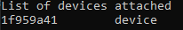

# tasks
Offline version: ready
 
Online Version: under development

## Check if your device is connecting correctly to ADB, Android Debug Bridge
``adb devices``
 
Seeing **device** in the right column means the device is connected. Example:

 

## To install dependencies on your machine
``npm install``

## To run the application without an emulator (run via USB)
### Android
``react-native run-android``

### iOS
``react-native run-ios``

## To view the application logs
### Android
``react-native log-android``

### iOS
``react-native log-ios``

## Project execution:
### Register account

 

### Login

 

### Add tasks

 

### View tasks

 

### Delete task

 

### Logout

 